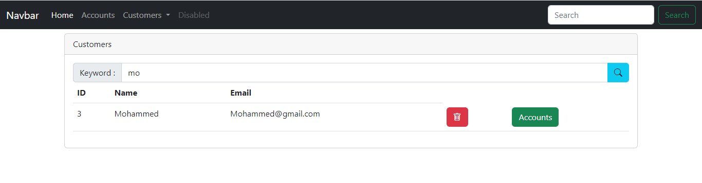
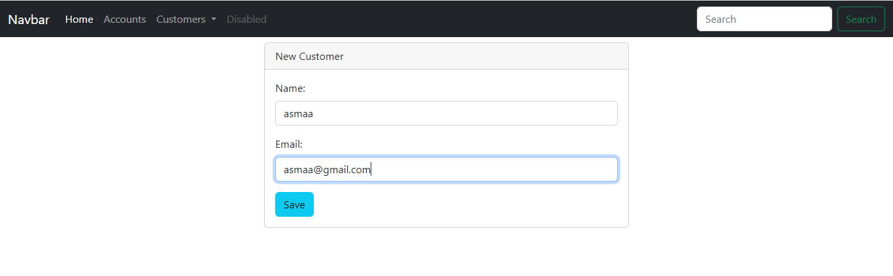
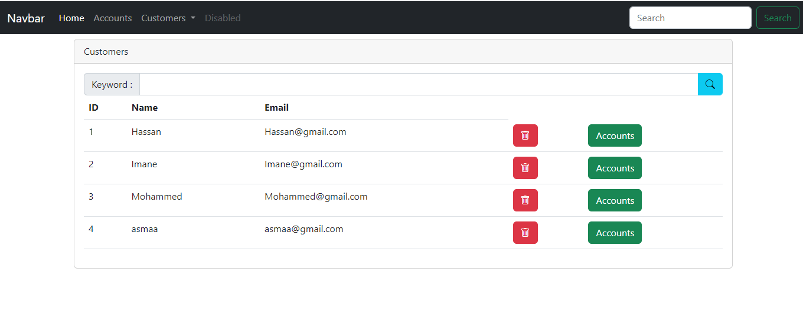
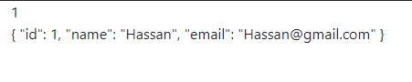
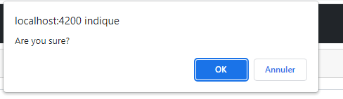
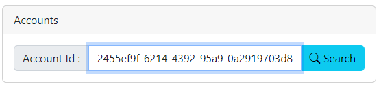
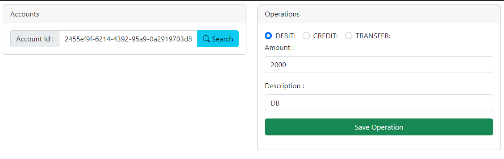
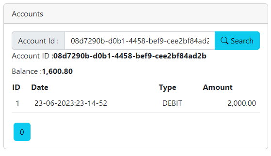

<h1>Compte Rendu du projet de l'activité pratique 5 intitulé digital ebanking</h1>
  Réalisée par:Qnais Asmaa
  <h3>Plan</h3>
  <ul>
 <li> Partie 1 : Couche DAO</li>
 <li>Partie 2 : Couche service, DTOs et RestController</li>
 <li>Partie 3 et 4 : Client Angular</li>
 </ul>
 On souhaite créer une application qui permet de gérer des comptes bancaires. chaque compte appartient à un client. un compte peut subir plusieurs opérations de type DEBIT ou CREDIT. Il existe deux types de comptes : Comptes courants et comptes épargnes.
  <h3> Partie 1 : Couche DAO</h3>
  Le principe du pattern DAO est de séparer la couche modèle d'une application en deux sous-couches distinctes :

une couche gérant les traitements métier appliqués aux données, souvent nommée couche service ou métier. Typiquement, tout le travail de validation réalisé dans nos objets InscriptionForm et ConnexionForm en fait partie ;
une couche gérant le stockage des données, logiquement nommée couche de données. Il s'agit là des opérations classiques de stockage : la création, la lecture, la modification et la suppression. Ces quatre tâches basiques sont souvent raccourcies à l'anglaise en CRUD.
Pour réaliser efficacement une telle opération, il est nécessaire d'encapsuler les exceptions spécifiques au mode de stockage dans des exceptions personnalisées et propres à la couche DAO. Dans notre cas par exemple, nous allons devoir faire en sorte que les exceptions propres à SQL ou à JDBC ne soient pas vues comme telles par nos objets métier, mais uniquement comme des exceptions émanant de la « boîte noire » qu'est notre DAO.
<h3> Partie 2 : Couche service, DTOs et RestController</h3>
Couche de services : Dans l'architecture logicielle, la couche de services est une couche intermédiaire entre la couche de présentation (interface utilisateur) et la couche d'accès aux données. Elle est responsable de la logique métier de l'application. Les services encapsulent des fonctionnalités spécifiques et peuvent être utilisés par les composants de l'interface utilisateur ou d'autres services. Ils permettent de séparer la logique métier de la logique d'accès aux données, favorisant ainsi la modularité et la réutilisabilité du code.
DTO (Data Transfer Object) : Les DTO sont des objets utilisés pour transférer des données entre différentes couches d'une application ou entre différentes applications. Ils sont généralement utilisés pour encapsuler un ensemble de données et les transférer efficacement entre les différents composants du système. Les DTO sont souvent utilisés dans les architectures basées sur des services pour minimiser le couplage entre les différentes couches. Ils peuvent être utilisés pour transférer des données entre le client et le serveur dans une application web.
RestController : Un RestController est un composant utilisé dans le développement d'une API REST (Representational State Transfer). Une API REST est un style d'architecture pour les systèmes distribués basés sur le protocole HTTP. Un RestController est responsable de la gestion des requêtes HTTP et de la fourniture de réponses appropriées. Il expose des points de terminaison (endpoints) qui peuvent être invoqués à l'aide de différentes méthodes HTTP telles que GET, POST, PUT, DELETE, etc. Les RestControllers sont couramment utilisés dans le développement d'applications web pour créer des services web RESTful.

En résumé, la couche de services est responsable de la logique métier de l'application, les DTO sont utilisés pour transférer des données entre les différentes couches et les RestControllers sont utilisés pour créer des services web RESTful et gérer les requêtes HTTP.
 <h3> Partie 3 et 4 : Client Angular</h3>
 Notre application est créee avec le framework angular pour la lancer il faut taper ng serve , cette fenetre s'ouvre:
 
 Il existe trois consumers Hassan,Imane et Mohammed avec un icone de suppression de client et l'autre pour consulter les comptes.
 Pour chercher un utilisateur par exemple Mohammed il suffit de taper mo sur la barre de recherche et la fonction s'exécute:
 
 Pour créer un nouveau client ,il siffit de remplir le formulaire suivant en tapant le nom et l'email et pour valider on tape save et le client va eter enregistrer.
  
  
  Pour consulter le compte d'un utilisateur il suffit de taper sur accounts:
   
   Afin de supprimer un client on tape l'icone rouge et un messgae de confirmation s'affiche:
    
    Et voila l'utilisateur asmaa est supprimé.
    
    La dernière fonctionnalite dans notre application et de consulter les comptes et faire quelques traitements de debit,credit et de transfert:
     
     Premièrement,on prend l'id du backend et on le colle sur la barre de recherche:
      
      Après le client a le choix de choisir quel opération il souhaite effectuer:
       
       A la fin ces inforamations vont etre enregistrés.
        
        Pour conclure ,cette application est une occasion d'appliquer les techniques apprises pendant le cours;elle comprenne tous les type de couches existantes dans un projet spring boot ainsi d'apprendre angular qui est un framework frontend. 
 

